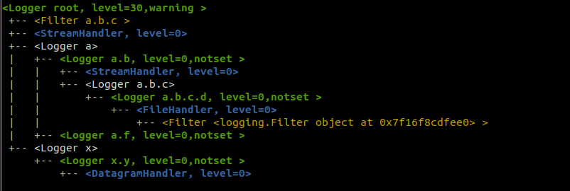

## logging_tree

An easy way to see the myriad of loggers/handlers/filters currently configured
in your code

* Logger objects are shown in green (placeholders are in white)
* Handlers objects are shown in Blue
* Filter objects are shown in yellow

## Installing and using the logging_tree utility

You can clone the project and install it from local source:

    git clone https://github.com/rustyhowell/logging_tree
    cd logging_tree
    pip install .

Or you can install it directly from github

    pip install git+https://github.com/rustyhowell/logging_tree.git

In your code:

    import logging_tree
    logging_tree.print_logging_tree(include_handlers=True)

You will see output like this:

    <Logger root, level=30,warning>
     +-- <Filter a.b.c >
     +-- <StreamHandler, level=0>
     +-- <Logger a>
     |   +-- <Logger a.b, level=0,notset >
     |   |   +-- <StreamHandler, level=0>
     |   |   +-- <Logger a.b.c>
     |   |       +-- <Logger a.b.c.d, level=0,notset >
     |   |           +-- <FileHandler, level=0>
     |   |               +-- <Filter <logging.Filter object at 0x7ff16f5cfee0> >
     |   +-- <Logger a.f, level=0,notset >
     +-- <Logger x>
         +-- <Logger x.y, level=0,notset >
             +-- <DatagramHandler, level=0>
